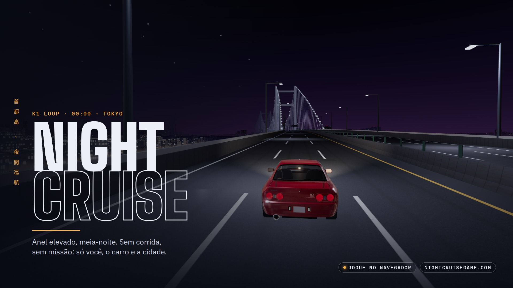

# Night Cruise · press kit

**Night Cruise** é um jogo de direção noturna em 3D que roda direto no navegador. Anel elevado de uma Tóquio fictícia, meia-noite: sem corrida, sem missão, só você, o carro e a cidade.

**Jogar:** https://www.nightcruisegame.com/
**Código:** https://github.com/souapenasjunior/night-cruise

Todas as imagens deste kit são capturas reais do jogo (sem retoque de cenário), com título e textos por cima.

---

## Textos prontos

### Uma linha
- **PT:** Dirija de madrugada pelas vias expressas elevadas de Tóquio. Grátis, no navegador.
- **EN:** Drive Tokyo's elevated expressways after midnight. Free, in your browser.

### Curto (bio, descrição de perfil)
- **PT:** Night Cruise: passeio noturno em 3D pelo anel elevado de uma Tóquio fictícia. Escolha um carro, entre na via expressa e dirija. Grátis no navegador.
- **EN:** Night Cruise: a 3D night drive around the elevated loop of a fictional Tokyo. Pick a car, get on the expressway and drive. Free in your browser.

### Longo (itch.io, página do jogo)
**PT:**
Anel K1, meia-noite. Sem corrida e sem missão: escolha um carro, entre na via expressa e dirija.

Night Cruise é um jogo de direção relaxante inspirado nas vias expressas de Tóquio (a Shuto Expressway). Um anel elevado de mais de 10 km passa por uma ponte estaiada sobre a baía, um túnel, um entroncamento e o centro da cidade, com trânsito, placas no estilo japonês e um estacionamento (PA) para parar e admirar a noite.

- 6 carros japoneses clássicos e 7 cores
- Anel elevado com ponte, túnel e estacionamento
- Placas no estilo da Shuto Expressway, com a linha de baixo em português ou inglês
- Teclado ou controle, com todos os botões remapeáveis
- Roda direto no navegador, sem instalar nada

**EN:**
K1 loop, midnight. No race, no mission: pick a car, get on the expressway and drive.

Night Cruise is a relaxed driving game inspired by Tokyo's expressways (the Shuto Expressway). An elevated loop of over 10 km crosses a cable-stayed bridge over the bay, a tunnel, a junction and downtown, with traffic, Japanese-style road signs and a parking area to stop and take in the night.

- 6 classic Japanese cars and 7 colours
- Elevated loop with a bridge, a tunnel and a parking area
- Shuto Expressway style signs, with the second line in English or Portuguese
- Keyboard or controller, every button remappable
- Runs in the browser, nothing to install

### Legendas para posts
1. Tóquio, meia-noite. O anel está livre. 🌃 Jogue grátis no navegador: nightcruisegame.com
2. Sem corrida. Sem missão. Só a via expressa e a cidade acesa. #NightCruise #indiegame #threejs
3. Escolha o seu: R32, S13, S14, 350Z, NSX ou o clássico dos anos 80. Estacione no Nishi PA e saia para a noite.
4. Placas no estilo da Shuto Expressway, com a linha de baixo no seu idioma. 🇧🇷 🇺🇸
5. (EN) Tokyo, midnight. The loop is yours. Free in your browser: nightcruisegame.com

**Hashtags:** #NightCruise #indiegame #indiedev #gamedev #threejs #webgl #browsergame #tokyo #shutoko #jdm #nightdrive

---

## Arquivos

| Arquivo | Uso |
|---|---|
| `keyart-1920x1080.jpg` | Imagem principal (key art): capa, página do jogo, divulgação |
| `x-header-1500x500.jpg` | Capa (header) do perfil no X/Twitter |
| `x-post-1600x900-1/2/3.jpg` | Posts no X/Twitter |
| `og-image-1200x630.jpg` | Prévia de link (WhatsApp, Discord, X, Facebook); já configurada no site |
| `github-social-1280x640.jpg` | Prévia do repositório no GitHub (Settings › Social preview) |
| `instagram-1080x1080-1/2/3.jpg` | Posts quadrados do Instagram |
| `instagram-1080x1350-1/2.jpg` | Posts verticais do Instagram (4:5) |
| `story-1080x1920-1/2.jpg` | Stories, Reels e capa de TikTok |
| `youtube-thumb-1280x720.jpg` | Miniatura (thumbnail) do YouTube |
| `itch-cover-630x500.jpg` | Capa da página no itch.io |
| `avatar-800x800.png` | Foto de perfil |
| `logo-transparent.png` | Logo com fundo transparente |
| `screenshots/` | Capturas limpas, sem texto (1920×1080) |
| `teaser-1920x1080.mp4` | Vídeo teaser (21 s) com a música do menu: YouTube, X |
| `teaser-vertical-1080x1920.mp4` | O mesmo teaser na vertical: Reels, TikTok, Shorts |

Nos stories, o conteúdo importante fica fora dos 250 px de cima e dos 340 px de baixo (áreas cobertas pela interface do app). Na capa do X, o canto inferior esquerdo fica livre para a foto de perfil.

---

## Créditos

- Jogo: souapenasjunior. Feito com [three.js](https://threejs.org/).
- Modelos 3D dos carros: Sketchfab, licença CC BY 4.0 (autores na tela Créditos do jogo). Nomes e marcas dos veículos pertencem aos respectivos fabricantes.
- Música do teaser e do menu (crédito obrigatório em qualquer publicação que use o vídeo):
  Warriyo - Mortals (feat. Laura Brehm) [NCS Release]
  Music provided by NoCopyrightSounds
  Free Download/Stream: http://ncs.io/mortals
  Watch: http://youtu.be/yJg-Y5byMMw
