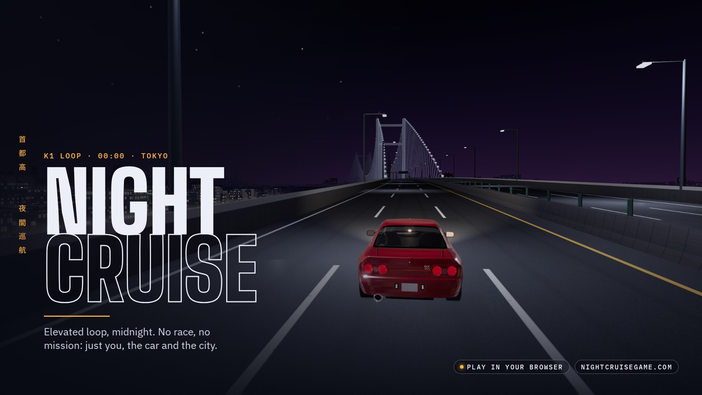

# Night Cruise · press kit (English)

**Night Cruise** is a 3D night-driving game that runs right in the browser. The elevated loop of a fictional Tokyo, at midnight: no race, no mission, just you, the car and the city.

**Play:** https://www.nightcruisegame.com/
**Code:** https://github.com/souapenasjunior/night-cruise

Every image in this kit is a real in-game capture (no scenery retouching), with the title and text laid over it. The Portuguese version of the kit is in the folder above (`presskit/`).

---

## Ready-made copy

### One line
Drive Tokyo's elevated expressways after midnight. Free, in your browser.

### Short (bio, profile description)
Night Cruise: a 3D night drive around the elevated loop of a fictional Tokyo. Pick a car, get on the expressway and drive. Free in your browser.

### Long (itch.io, game page)
K1 loop, midnight. No race, no mission: pick a car, get on the expressway and drive.

Night Cruise is a relaxed driving game inspired by Tokyo's expressways (the Shuto Expressway). An elevated loop of over 10 km crosses a cable-stayed bridge over the bay, a tunnel, a junction and downtown, with traffic, Japanese-style road signs and a parking area to stop and take in the night.

- 6 classic Japanese cars and 7 colours
- Elevated loop with a bridge, a tunnel and a parking area
- Shuto Expressway style signs, with the second line in English or Portuguese
- Keyboard or controller, every button remappable
- Runs in the browser, nothing to install

### Post captions
1. Tokyo, midnight. The loop is yours. 🌃 Play free in your browser: nightcruisegame.com
2. No race. No mission. Just the expressway and the city lights. #NightCruise #indiegame #threejs
3. Pick yours: R32, S13, S14, 350Z, NSX or the 80s classic. Park at Nishi PA and head into the night.
4. Shuto Expressway style signs, with the second line in your language. 🇺🇸 🇧🇷
5. Sound on. Lights off. nightcruisegame.com

**Hashtags:** #NightCruise #indiegame #indiedev #gamedev #threejs #webgl #browsergame #tokyo #shutoko #jdm #nightdrive

---

## Files

| File | Use |
|---|---|
| `keyart-1920x1080.jpg` | Main image (key art): cover, game page, press |
| `keyart-vertical-1080x1920.jpg` | Vertical key art 9:16: stories, phone wallpaper |
| `keyart-vertical-1080x1350.jpg` | Vertical key art 4:5: Instagram feed |
| `x-capa-1500x500.jpg` | **X/Twitter profile header** (the title stays clear of the avatar and the phone crop) |
| `x-perfil-1000x1000.png` | **X profile picture**: NC monogram, readable even when small |
| `x-perfil-foto-1000x1000.png` | Alternative profile picture (monogram over the blurred bridge) |
| `x-perfil-preview.jpg`, `x-perfil-foto-preview.jpg` | Preview of the profile with each option |
| `x-header-1500x500.jpg` | Alternative X header (the bay at night) |
| `x-post-1600x900-1/2/3.jpg` | X/Twitter posts |
| `og-image-1200x630.jpg` | Link preview (WhatsApp, Discord, X, Facebook) |
| `github-social-1280x640.jpg` | GitHub repository preview |
| `instagram-1080x1080-1/2/3.jpg` | Square Instagram posts |
| `instagram-1080x1350-1/2.jpg` | Portrait Instagram posts (4:5) |
| `story-1080x1920-1/2.jpg` | Stories, Reels and TikTok covers |
| `youtube-thumb-1280x720.jpg` | YouTube thumbnail |
| `itch-cover-630x500.jpg` | itch.io cover |
| `avatar-800x800.png` | Profile picture with the full logo |
| `logo-transparent.png` | Logo on a transparent background |
| `screenshots/` | Clean captures without text (1920×1080), signs in English |
| `teaser-1920x1080.mp4` | 21 s teaser with the menu music: YouTube, X |
| `teaser-vertical-1080x1920.mp4` | The same teaser, vertical: Reels, TikTok, Shorts |

In stories, keep important content out of the top 250 px and the bottom 340 px (covered by the app's interface). On the X header, the lower left corner stays free for the profile picture.

---

## Credits

- Game: souapenasjunior. Made with [three.js](https://threejs.org/).
- 3D car models: Sketchfab, CC BY 4.0 licence (authors on the game's Credits screen). Vehicle names and trademarks belong to their respective manufacturers.
- Music in the teaser and the menu (credit required in any post that uses the video):
  Warriyo - Mortals (feat. Laura Brehm) [NCS Release]
  Music provided by NoCopyrightSounds
  Free Download/Stream: http://ncs.io/mortals
  Watch: http://youtu.be/yJg-Y5byMMw
